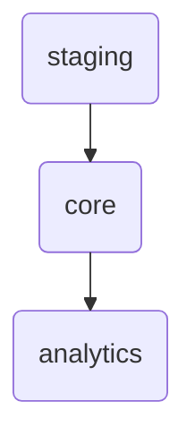
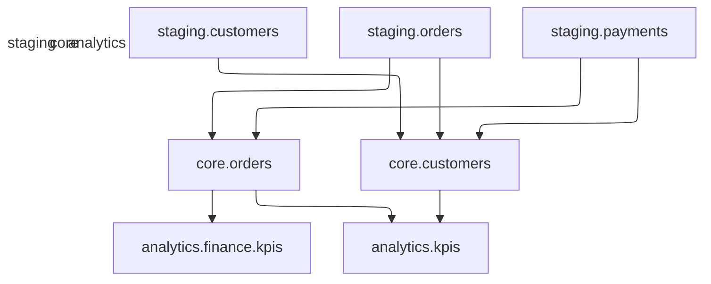

# Views

## Schemas

- [`analytics`](./analytics)
- [`core`](./core)
- [`staging`](./staging)

## Schema flowchart

```mermaid
%%{init: {"flowchart": {"defaultRenderer": "elk"}} }%%
flowchart TB
    analytics(analytics)
    core(core)
    staging(staging)
    core --> analytics
    staging --> core
```

## Flowchart

```mermaid
%%{init: {"flowchart": {"defaultRenderer": "elk"}} }%%
flowchart TB
    subgraph analytics
    end

    subgraph core
    end

    subgraph staging
    end

    core.orders --> analytics.finance.kpis
    core.customers --> analytics.kpis
    core.orders --> analytics.kpis
    staging.customers --> core.customers
    staging.orders --> core.customers
    staging.payments --> core.customers
    staging.orders --> core.orders
    staging.payments --> core.orders
```

