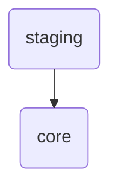
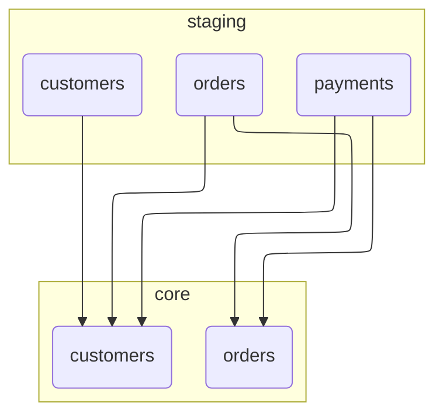

# Views

## Schemas

- [`core`](./core)
- [`staging`](./staging)

## Schema flowchart

```mermaid
%%{init: {"flowchart": {"defaultRenderer": "elk"}} }%%
flowchart TB
    core(core)
    staging(staging)
    staging --> core
```

## Flowchart

```mermaid
%%{init: {"flowchart": {"defaultRenderer": "elk"}} }%%
flowchart TB
    subgraph core
    core.customers(customers)
    core.orders(orders)
    end

    subgraph staging
    staging.customers(customers)
    staging.orders(orders)
    staging.payments(payments)
    end

    staging.customers --> core.customers
    staging.orders --> core.customers
    staging.payments --> core.customers
    staging.orders --> core.orders
    staging.payments --> core.orders
```

