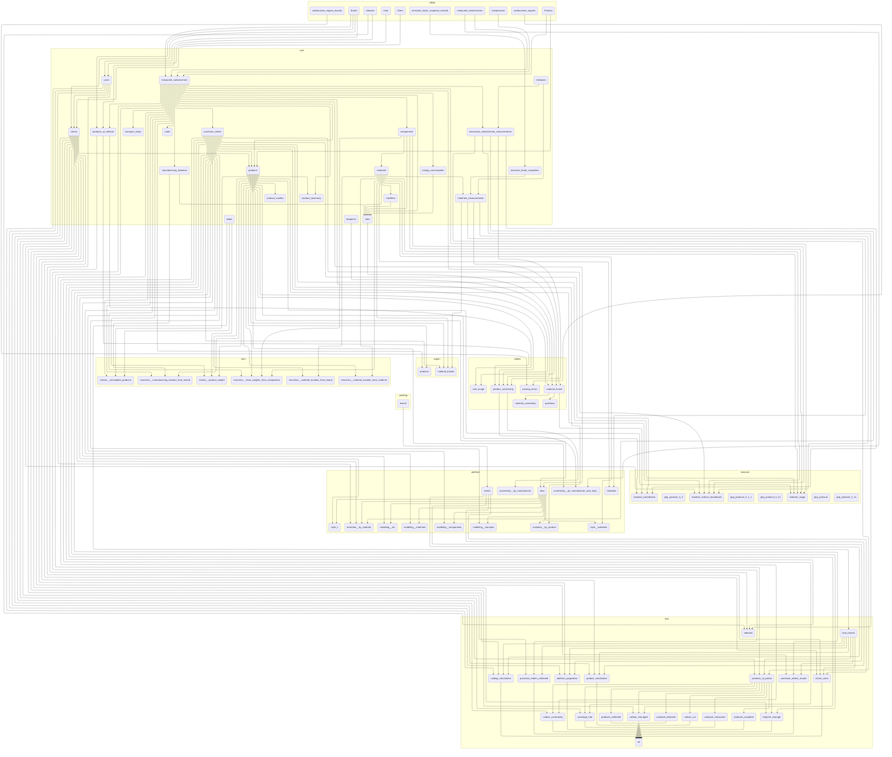

```mermaid
%%{init: {"flowchart": {"defaultRenderer": "elk"}} }%%
flowchart TB
    subgraph collect
    collect.material_funnel(material_funnel)
    collect.material_uncertainty(material_uncertainty)
    collect.parsing_errors(parsing_errors)
    collect.product_uncertainty(product_uncertainty)
    collect.questions(questions)
    collect.rule_usage(rule_usage)
    end

    subgraph core
    core.clients(clients)
    core.components(components)
    core.dates(dates)
    core.emission_factor_snapshots(emission_factor_snapshots)
    core.energy_consumption(energy_consumption)
    core.footprints(footprints)
    core.indicators(indicators)
    core.manufacturing_locations(manufacturing_locations)
    core.materials(materials)
    core.materials_measurements(materials_measurements)
    core.measured_carbonverses(measured_carbonverses)
    core.measured_carbonverses_measurements(measured_carbonverses_measurements)
    core.modifiers(modifiers)
    core.product_models(product_models)
    core.product_taxonomy(product_taxonomy)
    core.products(products)
    core.products_at_release(products_at_release)
    core.purchase_orders(purchase_orders)
    core.rules(rules)
    core.sales(sales)
    core.transport_steps(transport_steps)
    core.users(users)
    end

    subgraph export
    export.material_basket(material_basket)
    export.products(products)
    end

    subgraph kpis
    kpis.active_users(active_users)
    kpis.all(all)
    kpis.carbon_cut(carbon_cut)
    kpis.carbon_managed(carbon_managed)
    kpis.carbon_uncertainty(carbon_uncertainty)
    kpis.catalog_simulations(catalog_simulations)
    kpis.coverage_rate(coverage_rate)
    kpis.footprint_average(footprint_average)
    kpis.platform_pageviews(platform_pageviews)
    kpis.product_simulations(product_simulations)
    kpis.products_at_period(products_at_period)
    kpis.products_collected(products_collected)
    kpis.products_complete(products_complete)
    kpis.products_doomed(products_doomed)
    kpis.products_measured(products_measured)
    kpis.purchase_orders_collected(purchase_orders_collected)
    kpis.purchase_orders_issued(purchase_orders_issued)
    kpis.releases(releases)
    kpis.time_frames(time_frames)
    end

    subgraph measure
    measure.ghg_protocol(ghg_protocol)
    measure.ghg_protocol_3_11(ghg_protocol_3_11)
    measure.ghg_protocol_3_12(ghg_protocol_3_12)
    measure.ghg_protocol_3_1_1(ghg_protocol_3_1_1)
    measure.ghg_protocol_3_4(ghg_protocol_3_4)
    measure.material_contribution(material_contribution)
    measure.material_science_dashboard(material_science_dashboard)
    measure.material_usage(material_usage)
    end

    subgraph niklas
    niklas.Brand(Brand)
    niklas.Carbonverse(Carbonverse)
    niklas.Client(Client)
    niklas.Product(Product)
    niklas.User(User)
    niklas.carbonverse_import_records(carbonverse_import_records)
    niklas.carbonverse_imports(carbonverse_imports)
    niklas.emission_factor_snapshot_records(emission_factor_snapshot_records)
    niklas.measured_carbonverses(measured_carbonverses)
    niklas.releases(releases)
    end

    subgraph platform
    platform.events(events)
    platform.evolution__by_material(evolution__by_material)
    platform.evolution__by_product(evolution__by_product)
    platform.materials(materials)
    platform.modeling__components(modeling__components)
    platform.modeling__materials(modeling__materials)
    platform.modeling__rec(modeling__rec)
    platform.modeling__transport(modeling__transport)
    platform.skus(skus)
    platform.style__materials(style__materials)
    platform.style_s(style_s)
    platform.uncertainty__by_manufacturer(uncertainty__by_manufacturer)
    platform.uncertainty__by_manufacturer_and_style_(uncertainty__by_manufacturer_and_style_)
    end

    subgraph posthog
    posthog.events(events)
    end

    subgraph vera
    vera.checks__incomplete_products(checks__incomplete_products)
    vera.checks__product_weight(checks__product_weight)
    vera.heuristics__manufacturing_location_from_brand(heuristics__manufacturing_location_from_brand)
    vera.heuristics__material_location_from_brand(heuristics__material_location_from_brand)
    vera.heuristics__material_location_from_material(heuristics__material_location_from_material)
    vera.heuristics__shoe_weights_from_composition(heuristics__shoe_weights_from_composition)
    end

    collect.material_funnel --> collect.material_uncertainty
    niklas.carbonverse_imports --> collect.parsing_errors
    niklas.carbonverse_import_records --> collect.parsing_errors
    core.measured_carbonverses --> collect.product_uncertainty
    core.products_at_release --> collect.product_uncertainty
    core.products --> collect.product_uncertainty
    core.measured_carbonverses_measurements --> collect.product_uncertainty
    core.purchase_orders --> collect.product_uncertainty
    core.products_at_release --> collect.rule_usage
    core.rules --> collect.rule_usage
    collect.material_funnel --> collect.questions
    core.products --> collect.material_funnel
    core.footprints --> collect.material_funnel
    core.measured_carbonverses --> collect.material_funnel
    core.materials_measurements --> collect.material_funnel
    core.manufacturing_locations --> vera.heuristics__manufacturing_location_from_brand
    core.products --> vera.heuristics__manufacturing_location_from_brand
    core.measured_carbonverses --> vera.heuristics__manufacturing_location_from_brand
    core.materials --> vera.heuristics__material_location_from_material
    core.products --> vera.heuristics__material_location_from_material
    core.materials --> vera.heuristics__material_location_from_brand
    core.products --> vera.heuristics__material_location_from_brand
    core.products --> vera.heuristics__shoe_weights_from_composition
    core.materials --> vera.heuristics__shoe_weights_from_composition
    core.measured_carbonverses --> vera.heuristics__shoe_weights_from_composition
    core.components --> vera.heuristics__shoe_weights_from_composition
    core.products --> vera.checks__incomplete_products
    core.dates --> vera.checks__incomplete_products
    core.measured_carbonverses --> vera.checks__incomplete_products
    core.products --> vera.checks__product_weight
    core.dates --> vera.checks__product_weight
    core.measured_carbonverses --> vera.checks__product_weight
    core.materials --> core.materials_measurements
    core.indicators --> core.materials_measurements
    core.emission_factor_snapshots --> core.materials_measurements
    core.measured_carbonverses --> core.transport_steps
    niklas.User --> core.users
    niklas.Brand --> core.users
    core.measured_carbonverses --> core.purchase_orders
    core.measured_carbonverses --> core.components
    core.measured_carbonverses --> core.manufacturing_locations
    niklas.emission_factor_snapshot_records --> core.emission_factor_snapshots
    niklas.Carbonverse --> core.measured_carbonverses
    niklas.Brand --> core.measured_carbonverses
    niklas.Product --> core.measured_carbonverses
    niklas.measured_carbonverses --> core.measured_carbonverses
    core.clients --> core.products
    core.purchase_orders --> core.products
    core.measured_carbonverses --> core.products
    niklas.Product --> core.products
    core.components --> core.materials
    core.products --> core.product_models
    core.materials --> core.modifiers
    core.products --> core.product_taxonomy
    core.measured_carbonverses --> core.product_taxonomy
    niklas.Client --> core.clients
    core.users --> core.clients
    niklas.Brand --> core.clients
    niklas.Brand --> core.products_at_release
    core.measured_carbonverses --> core.products_at_release
    niklas.releases --> core.products_at_release
    core.indicators --> core.measured_carbonverses_measurements
    core.measured_carbonverses --> core.measured_carbonverses_measurements
    core.measured_carbonverses --> core.energy_consumption
    core.materials --> core.rules
    core.energy_consumption --> core.rules
    core.measured_carbonverses --> core.rules
    core.components --> core.rules
    core.modifiers --> core.rules
    core.manufacturing_locations --> core.rules
    core.measured_carbonverses --> core.sales
    collect.product_uncertainty --> platform.uncertainty__by_manufacturer
    core.products --> platform.uncertainty__by_manufacturer_and_style_
    collect.product_uncertainty --> platform.uncertainty__by_manufacturer_and_style_
    niklas.measured_carbonverses --> platform.uncertainty__by_manufacturer_and_style_
    platform.skus --> platform.evolution__by_product
    core.purchase_orders --> platform.evolution__by_product
    core.materials --> platform.materials
    core.materials_measurements --> platform.materials
    core.products --> platform.skus
    core.measured_carbonverses --> platform.skus
    core.materials --> platform.style__materials
    platform.skus --> platform.style__materials
    platform.skus --> platform.modeling__rec
    core.purchase_orders --> platform.modeling__rec
    platform.skus --> platform.modeling__transport
    core.purchase_orders --> platform.modeling__transport
    platform.skus --> platform.modeling__materials
    core.purchase_orders --> platform.modeling__materials
    posthog.events --> platform.events
    core.measured_carbonverses_measurements --> platform.evolution__by_material
    platform.skus --> platform.evolution__by_material
    core.purchase_orders --> platform.evolution__by_material
    core.measured_carbonverses --> platform.evolution__by_material
    platform.skus --> platform.style_s
    core.purchase_orders --> platform.style_s
    platform.skus --> platform.modeling__components
    core.purchase_orders --> platform.modeling__components
    core.clients --> kpis.purchase_orders_collected
    kpis.time_frames --> kpis.purchase_orders_collected
    core.measured_carbonverses --> kpis.purchase_orders_collected
    core.products_at_release --> kpis.releases
    core.purchase_orders --> kpis.releases
    core.measured_carbonverses_measurements --> kpis.releases
    niklas.releases --> kpis.releases
    core.clients --> kpis.catalog_simulations
    core.users --> kpis.catalog_simulations
    kpis.time_frames --> kpis.catalog_simulations
    platform.events --> kpis.catalog_simulations
    core.measured_carbonverses_measurements --> kpis.products_at_period
    core.clients --> kpis.products_at_period
    kpis.time_frames --> kpis.products_at_period
    core.measured_carbonverses --> kpis.products_at_period
    core.clients --> kpis.footprint_average
    core.purchase_orders --> kpis.footprint_average
    kpis.products_at_period --> kpis.footprint_average
    core.clients --> kpis.platform_pageviews
    core.users --> kpis.platform_pageviews
    kpis.time_frames --> kpis.platform_pageviews
    platform.events --> kpis.platform_pageviews
    kpis.products_at_period --> kpis.products_collected
    core.clients --> kpis.purchase_orders_issued
    kpis.time_frames --> kpis.purchase_orders_issued
    core.purchase_orders --> kpis.purchase_orders_issued
    core.clients --> kpis.product_simulations
    core.users --> kpis.product_simulations
    kpis.time_frames --> kpis.product_simulations
    platform.events --> kpis.product_simulations
    kpis.products_at_period --> kpis.products_measured
    core.clients --> kpis.carbon_managed
    core.purchase_orders --> kpis.carbon_managed
    kpis.products_at_period --> kpis.carbon_managed
    kpis.products_at_period --> kpis.products_doomed
    core.clients --> kpis.carbon_uncertainty
    core.purchase_orders --> kpis.carbon_uncertainty
    kpis.products_at_period --> kpis.carbon_uncertainty
    core.dates --> kpis.time_frames
    kpis.purchase_orders_collected --> kpis.all
    kpis.platform_pageviews --> kpis.all
    kpis.carbon_uncertainty --> kpis.all
    kpis.product_simulations --> kpis.all
    kpis.coverage_rate --> kpis.all
    kpis.products_collected --> kpis.all
    kpis.products_doomed --> kpis.all
    kpis.carbon_managed --> kpis.all
    kpis.carbon_cut --> kpis.all
    kpis.active_users --> kpis.all
    kpis.footprint_average --> kpis.all
    kpis.products_measured --> kpis.all
    kpis.products_complete --> kpis.all
    kpis.purchase_orders_issued --> kpis.all
    kpis.catalog_simulations --> kpis.all
    kpis.products_at_period --> kpis.carbon_cut
    core.clients --> kpis.coverage_rate
    core.purchase_orders --> kpis.coverage_rate
    kpis.products_at_period --> kpis.coverage_rate
    core.clients --> kpis.active_users
    core.users --> kpis.active_users
    kpis.time_frames --> kpis.active_users
    platform.events --> kpis.active_users
    kpis.products_at_period --> kpis.products_complete
    core.materials --> measure.material_usage
    core.products --> measure.material_usage
    core.measured_carbonverses --> measure.material_usage
    core.components --> measure.material_usage
    core.purchase_orders --> measure.material_usage
    core.measured_carbonverses_measurements --> measure.material_contribution
    core.products --> measure.material_contribution
    core.purchase_orders --> measure.material_contribution
    collect.material_funnel --> measure.material_contribution
    core.clients --> measure.material_science_dashboard
    core.components --> measure.material_science_dashboard
    core.materials_measurements --> measure.material_science_dashboard
    core.materials --> measure.material_science_dashboard
    core.products --> measure.material_science_dashboard
    core.purchase_orders --> measure.material_science_dashboard
    core.products --> export.products
    core.measured_carbonverses --> export.products
    core.products --> export.material_basket
    core.materials --> export.material_basket
    core.purchase_orders --> export.material_basket
    core.materials_measurements --> export.material_basket
```